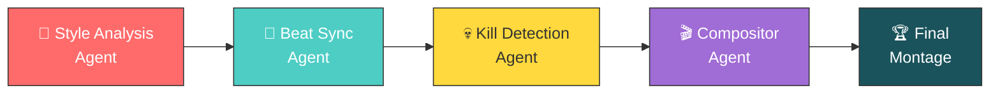

<div align="center">


# Autonomous AI Montage Editor for Free Fire

### *Strikes like lightning. Edits like a pro. Zero manual work.*

<br/>

[](https://python.org)
[](https://github.com/features/copilot)
[](https://github.com/microsoft/agentsleague)
[](README.md)
[](LICENSE)
[](README.md)

<br/>

**[▶ Watch Demo](#-demo)** &nbsp;•&nbsp; **[⚡ Quick Start](#-quick-start)** &nbsp;•&nbsp; **[🤖 Architecture](#-agentic-architecture)** &nbsp;•&nbsp; **[💀 Kill Detection](#-the-7-signal-kill-detection-engine)** &nbsp;•&nbsp; **[🎵 Beat Sync](#-beat-kill-synchronization)** &nbsp;•&nbsp; **[🛠 Stack](#-tech-stack)**

</div>

<br/>

---

## 🎬 Demo

<div align="center">

### [▶️ WATCH FULL DEMO ON YOUTUBE](PASTE_YOUR_YOUTUBE_LINK_HERE)

*Paste a reference montage URL, your raw gameplay, and a song — get a beat-synced, color-graded kill montage automatically.*

</div>

---

## ⚡ The Problem

<table>
<tr>
<td width="60%">

Free Fire content creators spend **3-4 hours** on every single montage:

- 🔍 Manually scrubbing through hours of footage to find kills
- 🎵 Manually syncing cuts to music beats by ear
- 🎨 Manually color grading every clip
- ✂️ Manually adding transitions, zooms, and effects
- 💰 Paying for expensive editing software

**Free Fire has 500M+ downloads and millions of mobile esports
creators — yet zero dedicated AI editing tools exist for them.**

</td>
<td width="40%">

### 📊 The Opportunity

| Metric | Value |
|---|---|
| Global downloads | **500M+** |
| Active creators | **Millions** |
| AI editing tools | **Zero** |
| Avg. edit time saved | **~3.5 hrs** |
| Cost to creator | **$0** |

</td>
</tr>
</table>

---

## ✅ The Solution

<div align="center">
📺 Reference Video  +  🎮 Your Footage  +  🎵 Your Music

│

▼

⚡ VOLTCUT-AGENT (one command)

│

▼

🏆 Professional Beat-Synced Montage

</div>

No editing software. No manual work. No API key required.
**Completely free, completely autonomous.**

---

## 🤖 Agentic Architecture

VOLTCUT-AGENT runs **four autonomous agents** in a coordinated pipeline.
Each agent makes independent decisions and passes its output to the
next — with **zero human intervention** from start to finish.



<table>
<tr>
<td width="50%" valign="top">
<h3>🎨 Style Analysis Agent</h3>
<p><strong>Input:</strong> Reference YouTube montage URL</p>
<p><strong>Output:</strong> Style profile JSON</p>
<p>Downloads the reference video and independently analyzes:</p>
<ul>
<li>📊 Cuts per minute &amp; average clip length</li>
<li>🎨 Color grade, brightness, saturation</li>
<li>✂️ Transition style (flash / hard cut)</li>
<li>⚡ Pacing intensity (slow → aggressive)</li>
</ul>
<p>Falls back to a built-in Free Fire style profile if no reference is given — never blocks the pipeline.</p>
</td>
<td width="50%" valign="top">
<h3>🎵 Beat Sync Agent</h3>
<p><strong>Input:</strong> Music file (MP3/WAV)</p>
<p><strong>Output:</strong> Frame-perfect beat map</p>
<p>Processes audio independently using librosa + scipy:</p>
<ul>
<li>🎼 BPM detection</li>
<li>🥁 Beat timestamps (snapped to 30fps frames)</li>
<li>💥 Bass drop detection (harmonic separation)</li>
<li>📈 Onset strength → strong vs regular beats</li>
</ul>
</td>
</tr>
<tr>
<td width="50%" valign="top">
<h3>💀 Kill Detection Agent</h3>
<p><strong>Input:</strong> Raw gameplay footage (any length up to 10 min)</p>
<p><strong>Output:</strong> Ranked kill clips</p>
<p>Scans frame-by-frame using 7 simultaneous CV signals (see below). Calculates an adaptive threshold unique to your footage — then auto-retries with lower thresholds if too few kills are found. Never returns empty-handed.</p>
</td>
<td width="50%" valign="top">
<h3>🎬 Compositor Agent</h3>
<p><strong>Input:</strong> Style profile + beat map + kill clips</p>
<p><strong>Output:</strong> Final MP4</p>
<p>Assembles everything autonomously:</p>
<ul>
<li>🎯 Syncs each kill exactly onto a beat (frame-perfect)</li>
<li>🎨 Clones color grade from the reference video</li>
<li>⚡ Flash transitions + zoom pulses on every cut</li>
<li>🥇 Highest-scoring kills get the bass drops</li>
<li>📹 Exports 1080p with 3-tier quality fallback</li>
</ul>
</td>
</tr>
</table>

---

## 💀 The 7-Signal Kill Detection Engine

The core innovation of VOLTCUT-AGENT — finding kill moments in raw footage with zero manual tagging, using pure computer vision.

<div align="center">

| # | Signal | Detects | Method |
|---|---|---|---|
| 1 | 🔴 Kill Feed | Red pixel spikes, top-right HUD | Color thresholding |
| 2 | ⚡ Screen Flash | Brightness spike on elimination | Luminance delta |
| 3 | 🎯 Optical Flow | Rapid aim-snap movement | Farneback flow |
| 4 | 🌊 Motion Score | Frame-to-frame intensity | Absolute diff |
| 5 | 🔫 Gun Recoil | Weapon kickback, lower screen | Region diff |
| 6 | 👤 Enemy Contours | Large objects entering frame | Canny edges |
| 7 | 🩸 Hit Effects | Red damage flash, center screen | Color zone analysis |

</div>

All 7 signals combine into a single weighted score per frame.

```python
auto_threshold = percentile(all_frame_scores, 80)
# ↳ Adapts to YOUR footage — fast gameplay vs slow gameplay
#   automatically get different thresholds

if kills_found < clips_needed:
    # Auto-retry with progressively lower thresholds
    # Up to 6 attempts — never returns empty
```

---

## 🎵 Beat-Kill Synchronization

Most "auto-editors" just cut on beats. VOLTCUT-AGENT goes further — the kill moment itself lands exactly on the beat.

<div align="center">

```
 🎸 Bass Drop    ──────►  Top-scoring kill   →  Big zoom + long flash
 🎵 Strong Beat  ──────►  High-scoring kill  →  Medium zoom + flash
 🎵 Regular Beat ──────►  Remaining kills    →  Standard zoom + flash
```

</div>

Each clip is trimmed so the kill action sits 0.3s into the clip — the exact point where the next beat lands. Not approximately. Frame-perfectly.

---

## ⚡ Quick Start

### 1️⃣ Clone & Install

```bash
git clone https://github.com/Appdeloper/VOLTCUT-AGENT.git
cd VOLTCUT-AGENT
pip install -r requirements.txt
```

### 2️⃣ Run

```bash
python run.py
```

### 3️⃣ Answer The Prompts

<div align="center">

| Prompt | What To Provide | Required? |
|---|---|---|
| 🔑 API Key | Gemini/Groq/OpenAI/Anthropic key | ❌ Optional |
| 📺 YouTube URL | Any Free Fire montage to copy the style | ❌ Optional |
| 🎮 Footage | Your raw gameplay MP4 (up to 10 min) | ✅ Required |
| 🎵 Music | Any MP3/WAV track | ❌ Optional* |
| ⏱️ Duration | 30s → 8min | ✅ Required |

*\*If skipped, VOLTCUT-AGENT auto-extracts the song from the reference video*

</div>

### 4️⃣ Get Your Montage

A finished, beat-synced, color-graded MP4 is saved to your project folder and plays automatically.

---

## 🔐 Security & Privacy

- 🙈 API keys entered via hidden prompt (like a password field)
- 💾 Stored only in local `.env` — never committed to GitHub
- 🆓 Fully optional — the entire pipeline runs without any key, using local computer vision and audio analysis only
- 🧹 `.gitignore` excludes all keys, footage, and generated media

---

## 🛠️ Tech Stack

<div align="center">

| Layer | Technology | Role |
|---|---|---|
| **Development** | GitHub Copilot | AI-assisted development throughout |
| **Orchestration** | Python 3.10+ | Core pipeline orchestration |
| **Computer Vision** | OpenCV | 7-signal kill detection vision agent |
| **Audio Analysis** | librosa + scipy | Beat & bass drop detection |
| **Video Rendering** | MoviePy + FFmpeg | Compositing & export |
| **Reference Processing** | yt-dlp | Style & song extraction |
| **Optional AI** | Gemini / Groq / OpenAI / Anthropic | Auto-detected enhanced analysis |

</div>

---

## 📁 Project Structure

```
VOLTCUT-AGENT/
├── ⚡ run.py                  Interactive launcher — start here
├── 🤖 agent.py                Master pipeline orchestrator
├── 🩺 check.py                Health check
├── 📦 requirements.txt
└── 📂 modules/
    ├── 🎨 style_analyzer.py    Style Analysis Agent
    ├── 🎵 beat_detector.py     Beat Sync Agent
    ├── 💀 clip_selector.py     Kill Detection Agent (7-signal)
    ├── 🎬 video_editor.py      Compositor Agent
    ├── 🌈 color_analyzer.py    Reference color cloning
    ├── 🎶 song_extractor.py    Auto song extraction
    ├── 🔐 key_manager.py       Secure API key handling
    └── ✅ validator.py         Pipeline validation
```

---

## 🎯 Why Free Fire — And What's Next

VOLTCUT-AGENT is purpose-built and fully working for **Free Fire**. Every detection zone, HUD region, and color profile is precisely calibrated to Free Fire's exact visual language — delivering accurate results out of the box on real gameplay.

### 🔮 Built To Expand
The 7-signal architecture is modular by design — each signal is a swappable detection zone. Future versions can recalibrate for:
- 🎮 BGMI / PUBG Mobile
- 🎮 Valorant
- 🎮 COD Mobile
- 🎮 Fortnite

**Plus:**
- 🖥️ Web UI for non-technical creators
- 📲 Direct upload to YouTube / Instagram Reels
- 🌟 Style presets learned from top creators
- ⏱️ Real-time detection during live gameplay

---

<div align="center">

### 🏆 Built For
**Microsoft Agents League Hackathon 2026**
Track: Creative Apps  |  Tool: GitHub Copilot

<br/>

Built with ⚡ by **Appdeloper**

<br/>

[](LICENSE)

*Free to use, modify, and distribute*

</div>