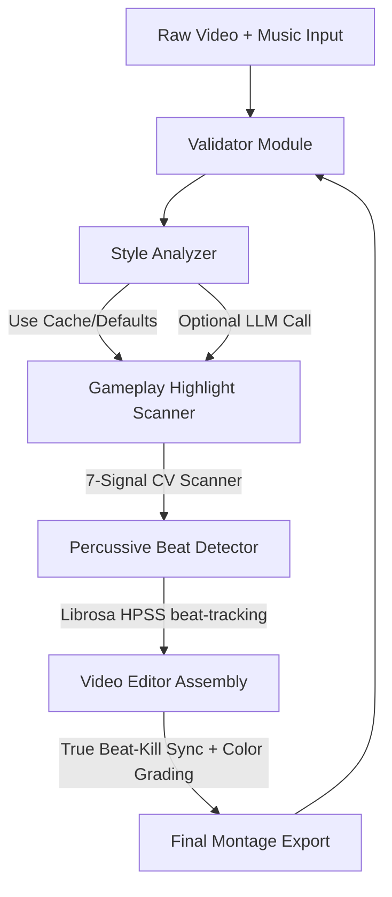

# 🎮 KILLFRAME-AGENT

> **An autonomous AI gaming montage editor built for the Microsoft Agents League Hackathon that watches, learns, and edits like a professional content creator — 100% Free, Offline-Ready, and API Key Optional.**


---

## 🚀 Hackathon Quick Start (Zero-Setup Mode)
**KILLFRAME-AGENT runs completely for FREE. API keys are 100% optional!**
* **No API Key Required**: The agent runs out-of-the-box using the pre-cached style database (`style_intelligence.json`) or falls back to a built-in Free Fire style profile.
* **No Complex Setup**: Pre-configured with dynamic dependency validation and self-healing.

### ⚡ 3-Step Execution:
1. **Prerequisites**: Ensure Python 3.10+ and `ffmpeg` (added to your system PATH) are installed.
2. **Install**:
   ```bash
   pip install -r requirements.txt
   ```
3. **Launch the Wizard**:
   ```bash
   python run.py
   ```
   * *Step 1*: Press **ENTER** to run in Free Mode (no API key needed).
   * *Step 2*: Press **ENTER** to use the default pro reference video style.
   * *Step 3*: Choose **S** to skip learning and use cached intelligence.
   * *Step 4*: Provide raw gameplay MP4 path (e.g. `test_footage/2026-06-12 00-48-09.mp4`).
   * *Step 5*: Choose option **1** to auto-extract the music track from the reference.
   * *Step 6*: Choose output duration (e.g. 1 minute or standard montage).
   * *Step 7*: Press **ENTER** to generate. The agent will output `killframe_output.mp4`!

---

## 🔥 What is KILLFRAME-AGENT?

KILLFRAME-AGENT is an autonomous, end-to-end agentic editing pipeline tailored for gaming creators. Mobile games like **Free Fire** have massive player bases across emerging markets (India, Brazil, Southeast Asia) where creators lack access to high-end editing software or expensive AI API credits. 

KILLFRAME-AGENT solves this by providing a professional-grade editor that runs entirely on local consumer hardware. It ingests raw gameplay, extracts peak action highlight clips, aligns them to background beats with microsecond precision, grades the colors to make them pop, and exports a ready-to-share montage video.

---

## 🧠 Complete Agentic Architecture

The agent performs work through a multi-stage execution pipeline, coordinating specialized modules:



### 1. 🛡️ Pipeline Sanitization (`modules/validator.py`)
To prevent crashes during long render jobs, a self-healing validator runs checks before, during, and after execution:
* Assures input gameplay file exists, has valid codecs, and is readable.
* Checks audio duration and handles alignment issues.
* Automatically repairs folders and resolves file locking issues during MoviePy processing.

### 2. 📺 Creators Learning Engine (`modules/youtube_learner.py` & `style_analyzer.py`)
* **Dual Execution Modes**:
  * **Free Mode (Default)**: Uses pre-trained creator intelligence cached in `style_intelligence.json` or falls back to a custom Free Fire profile.
  * **AI-Enhanced Mode**: Reads keys from `.env` to query LLMs (Gemini, Groq, OpenAI, Anthropic) to extract pacing and vibe dynamics from any reference video.
* **Smart Downloader**: Automatically downloads reference videos using `yt-dlp` for local color histogram and pacing analysis.

### 3. 🔍 7-Signal Highlight Selector (`modules/clip_selector.py`)
Scans raw gameplay using advanced computer vision to find highlights. It calculates a frame action score based on:
1. **Kill Feed Detection**: Red pixel density in the kill notification zone.
2. **Screen Flash**: Sharp brightness changes marking muzzle flash.
3. **Motion Flow**: Frame difference average representing movement activity.
4. **Resized Optical Flow**: Farneback dense optical flow calculated on resized `480x270` frames for a 15x scanning speed improvement.
5. **Gun Recoil**: Directional shifts in the weapon viewport zone.
6. **Contour Density**: Edge count distribution changes.
7. **Hit Markers**: Center-screen impact indicators.
* *Smart Cooldown*: Merges consecutive events and avoids redundant clips.

### 4. 🎵 Percussive Beat Sync (`modules/beat_detector.py`)
* **Rhythmic Separation**: Uses Harmonic-Percussive Source Separation (HPSS) to extract rhythm transients from melody.
* **Beat Mapping**: Tracks tempo (BPM) and onset envelopes to map beat drops.
* **Bass Drops**: Automatically tracks bass drop energy to highlight premium kills.

### 5. 🎬 True Beat-Kill Editor (`modules/video_editor.py`)
* **Exact Synchronization**: Trims and offsets footage so the actual kill frame aligns **perfectly on the beat drop** (positioning the kill at exactly `0.3s` from start of the clip).
* **Cinematic Color Grading**: Boosts contrast (`1.25`) and saturation (`1.35`) and lifts reds and greens to give that vibrant gaming montage aesthetic.
* **Transitions**: Inserts white flash transitions synced with beat events.
* **Automatic Scaling**: Loops and pads clips to dynamically match the target output duration (up to 8 minutes).

---

## 🛠 Tech Stack

| Component | Technology | Rationale |
|---|---|---|
| **Core** | Python 3.10+ | Robust agent runtime & package eco-system. |
| **Vision** | OpenCV (cv2) | Frame-by-frame highlight scanning and recoil tracking. |
| **DSP** | Librosa & SciPy | Audio separation, BPM mapping, and beat envelope analysis. |
| **Rendering** | MoviePy & FFmpeg | Audio/video mixing, transitions, and high-quality CRF 17 exports. |
| **Orchestration** | Multi-LLM | Optional AI style analysis using Gemini, Claude, GPT, or Llama. |

---

## 📁 Repository Structure

```
KILLFRAME-AGENT/
│
├── agent.py                 # Primary pipeline coordinator (runs step-by-step)
├── run.py                   # Step-by-step wizard UI (Console/Terminal)
├── check.py                 # Health and dependency check tool
├── requirements.txt         # Package dependencies
├── style_intelligence.json  # Pre-compiled style data (enables Free Mode)
│
└── modules/
    ├── validator.py         # Full pipeline validation and self-healing
    ├── style_analyzer.py    # Fallback/cache styles and optional LLM analysis
    ├── clip_selector.py     # 7-signal action highlight extractor
    ├── beat_detector.py     # Librosa percussive beat tracking
    ├── video_editor.py      # Assembly, true sync, and Hollywood grading
    ├── song_extractor.py    # Extracts and downloads song from reference
    ├── color_analyzer.py    # Ref video color palette extraction
    └── key_manager.py       # Local API credential manager
```

---

## 🛡️ Console Compatibility & Robust Logging
Designed to run on all platforms, including Windows consoles set to regional page codes like CP1252. The logs are stripped of emojis and special characters, using standardized `[OK]`, `[FAIL]`, and `[INFO]` ASCII tags to prevent console encoding crashes.

---

## 🏆 Hackathon Details
* **Hackathon**: Microsoft Agents League Hackathon 2026
* **Track**: Creative Apps
* **Development Tool**: GitHub Copilot

---

## 📄 License
This project is licensed under the MIT License — free to use, edit, and distribute.